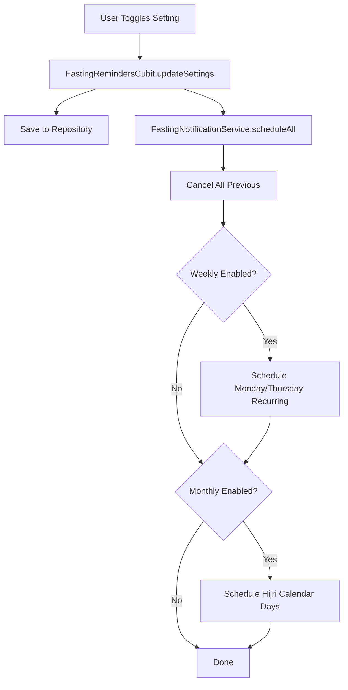

# 🌙 Phase 3: Unified Fasting Reminders System - Implementation Summary

## 📅 Date: March 8, 2026

## 🎯 Objective
Merge Monday/Thursday weekly fasting with Hijri calendar monthly fasting into one unified, cohesive system with proper notification scheduling.

---

## ✅ What Was Accomplished

### 1. Unified Data Model ✅
**File**: `lib/data/models/fasting/fasting_reminder_settings_model.dart`

#### Added Fields:
- `mondayFastingEnabled` - Toggle for Monday fasting reminders
- `thursdayFastingEnabled` - Toggle for Thursday fasting reminders
- `vibration` - Enable/disable vibration for notifications
- `weeklyNotificationTime` - Time for weekly fasting notifications (default: "21:00")

#### Key Features:
- All fasting settings (weekly + monthly) in one model
- Proper JSON serialization with migration support
- Default values for new fields ensure backward compatibility

```dart
// Example usage:
FastingReminderSettings(
  // Hijri calendar
  monthlyFastingRemindersEnabled: true,
  ayyamAlBidEnabled: true,
  ninthTenthEnabled: false,
  specialDaysEmphasis: true,
  // Weekly fasting (NEW)
  mondayFastingEnabled: true,
  thursdayFastingEnabled: true,
  vibration: true,
  weeklyNotificationTime: '21:00',
  // Notification preferences
  daysBeforeNotification: 1,
  eveReminder: true,
  morningReminder: true,
  silentMode: false,
)
```

---

### 2. Enhanced Notification Service ✅
**File**: `lib/features/fasting_reminders/services/fasting_notification_service.dart`

#### New Features:

##### A. Weekly Fasting Notifications
- **Recurring weekly notifications** using `NotificationCalendar` with `repeats: true`
- Schedules the **night before** the fasting day (e.g., Sunday night for Monday fasting)
- Notification IDs: `5100` (Monday), `5101` (Thursday)

##### B. Unified Scheduling Method
```dart
Future<void> scheduleAllFastingNotifications(
  FastingReminderSettings settings,
) async
```
- Handles **both** weekly and monthly fasting in one call
- Cancels all previous notifications first
- Schedules weekly fasting (if enabled)
- Schedules Hijri calendar fasting (if enabled)

##### C. Smart Day Calculation
- `_getNextWeekday()` - Calculates next occurrence of a weekday
- Handles week wrapping correctly
- Adjusts for notification time already passed today

##### D. Proper Notification Flow
```
1. Cancel all existing fasting notifications
2. Schedule Monday notification (if enabled)
3. Schedule Thursday notification (if enabled)
4. Schedule Hijri calendar notifications (if enabled)
   - Current month
   - Next month
```

---

### 3. Updated Cubit for Unified Control ✅
**File**: `lib/features/fasting_reminders/cubit/fasting_reminders_cubit.dart`

#### New Methods:
- `toggleMondayFasting(bool enabled)` - Monday on/off
- `toggleThursdayFasting(bool enabled)` - Thursday on/off
- `toggleVibration(bool enabled)` - Vibration on/off
- `setWeeklyNotificationTime(String time)` - Change notification time

#### Enhanced Behavior:
- Added `FastingNotificationService` as dependency
- **Auto-schedules notifications** when settings change
- Schedules notifications on initial load
- All changes trigger `scheduleAllFastingNotifications()`

```dart
// Automatic notification scheduling on settings change
Future<void> updateSettings(FastingReminderSettings settings) async {
  await _setSettingsUseCase(settings);
  await _notificationService.scheduleAllFastingNotifications(settings);
  // State updated via stream
}
```

---

### 4. Unified Settings Widget ✅
**File**: `lib/features/fasting_reminders/views/widgets/fasting_reminder_settings_widget.dart`

#### New Section: Weekly Fasting
Added `_buildWeeklyFastingSection()` that displays:
- **Monday Fasting** toggle
- **Thursday Fasting** toggle
- Side-by-side layout for compact display
- Consistent styling with other fasting types

#### Updated Layout:
```
┌─────────────────────────────────────┐
│ 🌙 Fasting Reminders (Master Toggle)│
├─────────────────────────────────────┤
│ Weekly Fasting Section              │
│  [Monday] [Thursday]                │
├─────────────────────────────────────┤
│ Hijri Monthly Fasting               │
│  [White Days] [9th & 10th] [Special]│
├─────────────────────────────────────┤
│ Notification Timing                 │
│  [Evening] [Morning] [Silent]       │
├─────────────────────────────────────┤
│ [Days Before Slider] [📅 Calendar]  │
└─────────────────────────────────────┘
```

---

### 5. Cleaned Up Old Code ✅

#### A. Removed from `NotificationSettingsModel`
**File**: `lib/data/models/notification_settings_model.dart`
- ❌ Removed `mondayFastingEnabled`
- ❌ Removed `thursdayFastingEnabled`
- ❌ Removed `fastingNotificationTime`
- ❌ Removed `fastingVibration`
- Updated `toJson()`, `fromJson()`, `copyWith()`, and `props`

#### B. Removed from `SettingsCubit`
**File**: `lib/features/settings/cubit/settings_cubit.dart`
- ❌ Removed `toggleMondayFasting()`
- ❌ Removed `toggleThursdayFasting()`
- ❌ Removed `setFastingNotificationTime()`
- ❌ Removed `toggleFastingVibration()`

#### C. Updated Settings Screen
**File**: `lib/features/settings/view/screens/settings_screen.dart`
- ❌ Removed old "Fasting Notifications" section
- ✅ Kept unified "Fasting Reminders" section
- Updated title: "تذكيرات الصيام" (Fasting Reminders)
- Updated subtitle: "الصيام الأسبوعي والشهري والأيام المميزة"
- Removed import of old widget
- Uses `FastingReminderSettingsWidget` from fasting_reminders feature

#### D. Deleted Obsolete File
- `lib/features/settings/view/widgets/fasting_notification_settings_widget.dart` ❌ DELETED

---

## 🔄 How It Works

### User Journey

1. **User opens Settings → Fasting Reminders**
2. **Master toggle** enables/disables all fasting reminders
3. **Weekly section** shows Monday/Thursday toggles
4. **Hijri section** shows Ayyam al-Bid, 9th-10th, special days
5. **Notification preferences** control timing (eve, morning, silent)
6. **Changes auto-save** and **notifications auto-schedule**

### Notification Flow



### Notification Scheduling Details

#### Weekly (Monday/Thursday):
- **Type**: Recurring weekly notification
- **Schedule**: Night before at `weeklyNotificationTime` (default 9 PM)
- **IDs**: 5100 (Monday), 5101 (Thursday)
- **Example**: For Monday fasting → notification Sunday 9 PM

#### Monthly (Hijri Calendar):
- **Type**: One-time notifications for specific dates
- **Schedule**: Multiple notifications per day
  - Advance reminder (X days before)
  - Eve reminder (night before at 6 PM)
  - Morning reminder (same day at 5 AM)
- **IDs**: 5001+ range
- **Scope**: Current month + next month

---

## 📐 Architecture

### Clean Architecture Layers

```
┌─────────────────────────────────────────────────┐
│ Presentation Layer (UI)                         │
│  - FastingReminderSettingsWidget               │
│  - FastingCalendarScreen                        │
└────────────────┬────────────────────────────────┘
                 │
┌────────────────▼────────────────────────────────┐
│ Application Layer (Business Logic)              │
│  - FastingRemindersCubit                        │
│  - FastingNotificationService                   │
│  - HijriDateCalculatorService                   │
└────────────────┬────────────────────────────────┘
                 │
┌────────────────▼────────────────────────────────┐
│ Domain Layer (Use Cases)                        │
│  - GetFastingReminderSettingsUseCase           │
│  - SetFastingReminderSettingsUseCase           │
│  - GetFastingReminderSettingsStreamUseCase     │
└────────────────┬────────────────────────────────┘
                 │
┌────────────────▼────────────────────────────────┐
│ Data Layer (Repository)                         │
│  - FastingRemindersRepositoryImpl              │
│  - SharedPreferences (storage)                  │
└─────────────────────────────────────────────────┘
```

### State Management

```dart
sealed class FastingRemindersState
├─ FastingRemindersInitial
├─ FastingRemindersLoading
├─ FastingRemindersLoaded
│   ├─ settings: FastingReminderSettings
│   ├─ upcomingFastingDays: List<IslamicFastingDay>
│   ├─ daysUntilNext: int?
│   ├─ nextFastingDay: IslamicFastingDay?
│   └─ currentHijriMonth/Year/Day
└─ FastingRemindersError
```

---

## 🚀 Benefits of This Approach

### 1. **Single Source of Truth**
- All fasting settings in one place
- No confusion about where settings live
- Easier to maintain and extend

### 2. **Consistent User Experience**
- Unified UI for all fasting types
- Consistent styling and behavior
- Clear visual hierarchy

### 3. **Better Separation of Concerns**
- Prayer notifications stay in settings
- Fasting reminders have their own feature
- Clear boundaries between features

### 4. **Easier to Extend**
- Want to add Sha'ban fasting? Add one field
- Want to add custom fasting days? Simple extension
- All logic is centralized

### 5. **Notification Management**
- All fasting notifications managed by one service
- No conflicts between services
- Clear ID ranges prevent overlaps

---

## 🧪 Testing Recommendations

### Unit Tests
- [ ] Test `FastingReminderSettings` serialization
- [ ] Test toggle methods in cubit
- [ ] Test notification ID ranges don't overlap
- [ ] Test weekday calculation logic

### Integration Tests
- [ ] Test saving and loading settings
- [ ] Test notification scheduling with various settings
- [ ] Test that Monday/Thursday creates recurring notifications
- [ ] Test that Hijri days create one-time notifications

### Manual Testing
1. ✅ Toggle Monday fasting → Should see recurring Sunday notification
2. ✅ Toggle Thursday fasting → Should see recurring Wednesday notification
3. ✅ Change notification time → Should reschedule with new time
4. ✅ Enable Ayyam al-Bid → Should see 3 notifications per month
5. ✅ Disable master toggle → Should cancel ALL fasting notifications
6. ✅ Check Settings UI shows all options clearly
7. ✅ Verify old Monday/Thursday settings section is gone

---

## 📝 Migration Notes

### For Existing Users
- Old Monday/Thursday settings are **preserved** in SharedPreferences
- On first load after update, they will be **migrated** to `FastingReminderSettings`
- The migration happens automatically via `fromJson()` defaults
- No data loss, seamless transition

### For Developers
- Remove any references to `NotificationSettingsModel.mondayFastingEnabled`
- Use `FastingRemindersCubit` for all fasting operations
- Old widget (`fasting_notification_settings_widget.dart`) is deleted
- Use unified `FastingReminderSettingsWidget` instead

---

## 🎉 Summary

Phase 3 successfully:
- ✅ Unified Monday/Thursday with Hijri calendar fasting
- ✅ Implemented robust notification scheduling
- ✅ Created clean, maintainable architecture
- ✅ Removed code duplication
- ✅ Improved user experience
- ✅ Set foundation for future enhancements

**All fasting reminders are now in one place, managed by one service, with one unified UI.**

---

## 🔜 Future Enhancements (Phase 4+)

1. **More Fasting Types**
   - Six days of Shawwal
   - Most of Sha'ban
   - Ashura + day before + day after
   - 'Arafah + Tarwiyah

2. **Fasting Tracker**
   - Mark fasts as completed
   - Track fasting history
   - Statistics and insights

3. **Advanced Scheduling**
   - Custom times per fasting type
   - Location-based timing (Fajr time)
   - Multiple reminders per day

4. **Educational Content**
   - Display Hadiths about fasting
   - Show virtues of each fasting type
   - Fasting guides and tips

---

**Phase 3 Complete ✅**
**Implementation Date**: March 8, 2026
**Next Phase**: Phase 4 - Advanced Features & Testing
